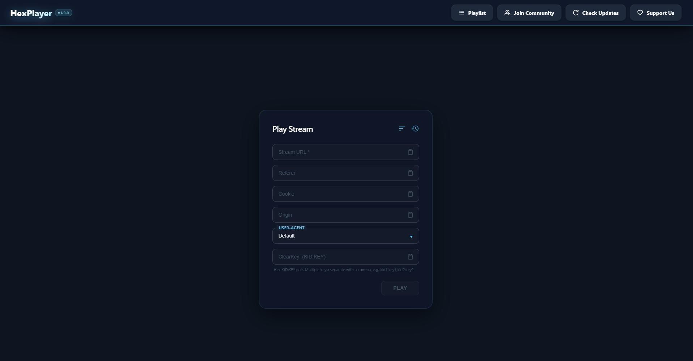
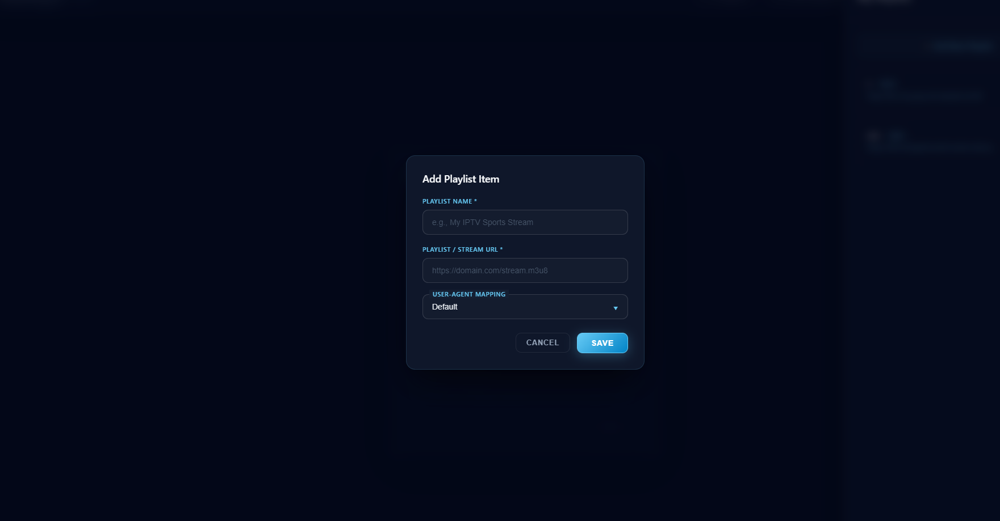

# HexPlayer

  

  <strong>A sleek, modern, and high-performance IPTV & Media Player for Windows.</strong>

  <a href="#-key-features">Features</a> •
  <a href="#-screenshots">Screenshots</a> •
  <a href="#️-installation">Installation</a> •
  <a href="#-technologies-used">Tech Stack</a>

---

## 🚀 Overview

**HexPlayer** is a feature-rich, desktop media player designed for the modern streaming era. Engineered on top of Electron, it offers a fluid, dark-themed user interface tailored for Windows. HexPlayer goes beyond standard video playback by offering robust support for advanced streaming protocols, protected DRM assets, and customizable request headers—making it the ultimate tool for both casual viewers and IPTV developers.

---

## ✨ Key Features

*   📺 **Advanced Protocol Support:** Seamless playback for high-quality **HLS (`.m3u8`)** and **DASH (`.mpd`)** network streams.
*   🔑 **DRM & ClearKey Decryption:** Native capability to handle AES-128 ClearKey and secured streams without external plugins.
*   🛠️ **Custom Headers Injection:** Fully configure headers such as `User-Agent`, `Referer`, or custom auth tokens to securely bypass strict stream restrictions.
*   🖼️ **Picture-in-Picture (PiP):** Keep your stream pinned on top while you work with an optimized, lightweight PiP mode.
*   ⚡ **Hardware Acceleration:** Smooth, stutter-free playback optimized for HD and 4K live sports or media content.

---

## 📸 Screenshots

  
  &nbsp;&nbsp;
  

---

## 🛠️ Installation

Getting started with HexPlayer is quick and straightforward:

1. Head over to the [Releases](https://github.com/xlaro/HexPlayer/releases/) page.
2. Download the latest installer: `HexPlayer_Setup_1.0.0.exe`.
3. Run the installer and launch the application.
4. Input your stream URL or IPTV playlist and click play!

### System Requirements
*   **OS:** Windows 10 / 11 (64-bit)
*   **Network:** Broadband internet connection for stable live streaming.

---

## 💻 Technologies Used

*   **Frontend & Shell:** Electron, HTML5, CSS3
*   **Player Core:** Highly optimized video engine with robust manifest parsing for DASH/HLS.

---

## 📄 License

This project is licensed under the MIT License - see the [LICENSE](LICENSE) file for details.
